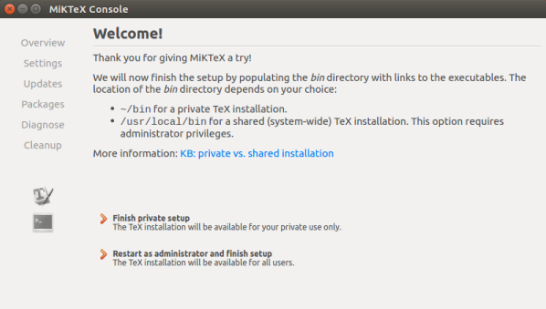
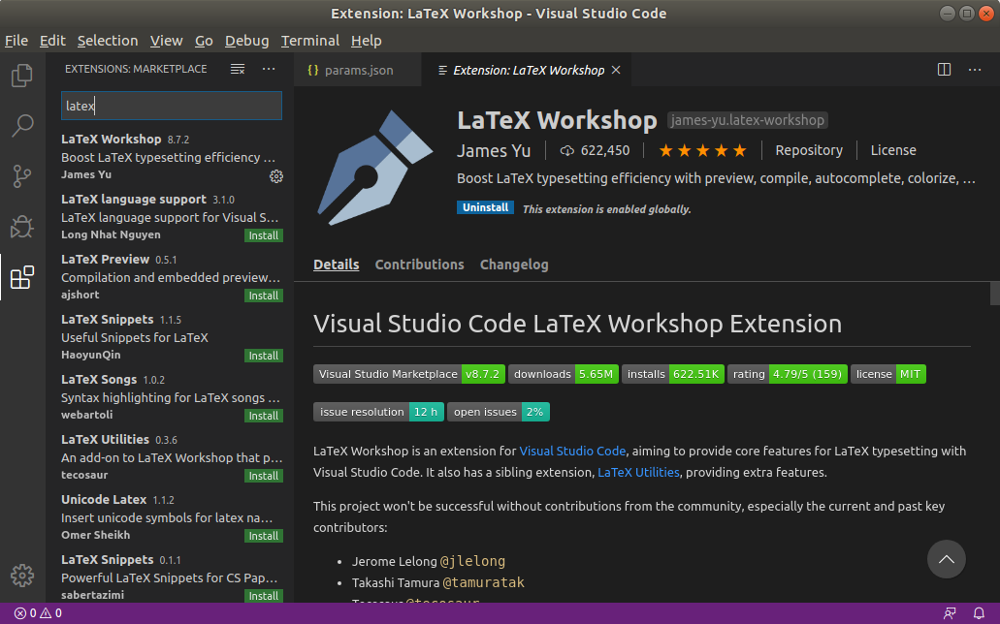

# 武汉理工大学本科毕业论文 LaTeX 模版

## Introduction

This template is for undergraduate thesis at [Wuhan University of Techology](http://english.whut.edu.cn). 
LaTeX is a popular typesetting document preparation system in many scientific fields.
All questions and suggestions are welcomed, please file an issue in this repo.

## 简介
本模板是[武汉理工大学](http://www.whut.edu.cn)本科生毕业论文LaTeX免费模板（**非官方**）。LaTeX是一个流行的编辑科学类文章的工具。
大多数科学类书籍，期刊，文章都采用了LaTeX。
使用这个模板可以使你从无聊的格式限制中解脱出来，从而更专注地阐述自己的想法。
希望本模板能够帮助你入门LaTeX, 如果你有关于本模板的良好意见和建议，请在顶栏的问题(issue)一栏中提出。


## 使用方法

### Linux

#### Step1：安装*LaTeX*发行版

你可以选择安装 **texlive** 或者 **MiKTeX** ；texlive 有多种安装包，可以选择适合你需求的包下载：

- texlive-base - 136 MB
- texlive-latex-recommended - 177 MB
- texlive - 240 MB
- texlive-latex-extra - 404 MB
- texlive-full - 4714 MB

但是 Linux 下的 texlive 暂时没有自动下载宏包的能力，这意味着如果你下载的 texlive 不是完整版，你可能会缺少需要的宏包；所以这里推荐使用 miktex，它可以按需安装宏包，更轻便，你可以使用下面的命令快速安装 miktex，或者[查看详细的 MiKTeX 安装步骤](https://miktex.org/howto/install-miktex-unx)：

1. 注册 GPG 秘钥

   ```shell
   sudo apt-key adv --keyserver hkp://keyserver.ubuntu.com:80 --recv-keys D6BC243565B2087BC3F897C9277A7293F59E4889
   ```

2. 添加安装源

   如果你是 Ubuntu 18.04：

   ```shell
   echo "deb http://miktex.org/download/ubuntu bionic universe" | sudo tee /etc/apt/sources.list.d/miktex.list
   ```

   如果你是  Ubuntu 16.04：

   ```shell
   echo "deb http://miktex.org/download/ubuntu xenial universe" | sudo tee /etc/apt/sources.list.d/miktex.list
   ```

3. 安装 MiKTeX

   ```shell
   sudo apt-get update
   sudo apt-get install miktex
   ```

4. 设置 MiKTeX

   在 application 中搜索 `MiKTeX Console` 并打开，点击`Finish private setup`等待配置完成即可。

   

#### Step2：安装文本编辑器

1. 配置环境

   使用任意你喜欢的文本编辑器，这里推荐使用 **VSCode** ，并安装 **LaTeX Workshop** 插件。

   
   
2. [option] 编译链设置如下：

    ```
        "latex-workshop.latex.tools": [
            {
                // 编译工具和命令
                "name": "xelatex",
                "command": "xelatex",
                "args": [
                    "-synctex=1",
                    "-interaction=nonstopmode",
                    "-file-line-error",
                    "-pdf",
                    "%DOCFILE%"
                ]
            },
            {
                "name": "biber",
                "command": "biber",
                "args": [
                    "%DOCFILE%"
                ]
            },
            {
                "name": "bibtex",
                "command": "bibtex",
                "args": [
                    "%DOCFILE%"
                ]
            }
    
        ],
        "latex-workshop.latex.recipes": [
            {
                "name": "xelatex",
                "tools": [
                    "xelatex"
                ]
            },
            {
                "name": "xelatex -> bibtex -> xelatex*2",
                "tools": [
                    "xelatex",
                    "bibtex",
                    "xelatex",
                    "xelatex"
                ]
            },
        ]
    ```

#### Step3：尝试编译

设定主文档为`thesis.tex`，VSCode 将自动开始尝试编译；或者你可以在 VSCode 中的 command palette 键入`build latex project`手动触发编译。等待 VSCode 编译完毕，左下角显示绿色钩√符号；在 command palette 键入`view latex PDF file`查看以 PDF 。

#### Step4：开始你的*LaTeX*之旅

### Windows

欢迎补充

### MacOS

欢迎补充

### Overleaf 在线编译

欢迎补充

## 致谢

- [How to install LaTex on Ubuntu 18.04 Bionic Beaver Linux](https://linuxconfig.org/how-to-install-latex-on-ubuntu-18-04-bionic-beaver-linux)

- [Install MiKTeX for Linux - MiKTeX.org](https://miktex.org/howto/install-miktex-unx)

- [mtobeiyf/whu-thesis](https://github.com/mtobeiyf/whu-thesis)

- [tsaoyu/WHUT-LaTeX-bachelor](https://github.com/tsaoyu/WHUT-LaTeX-bachelor)